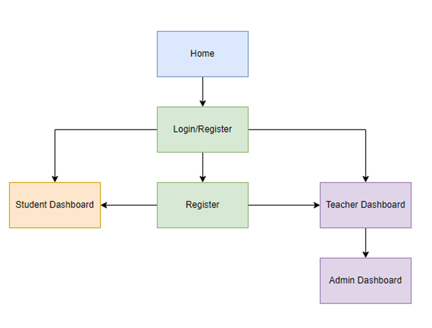
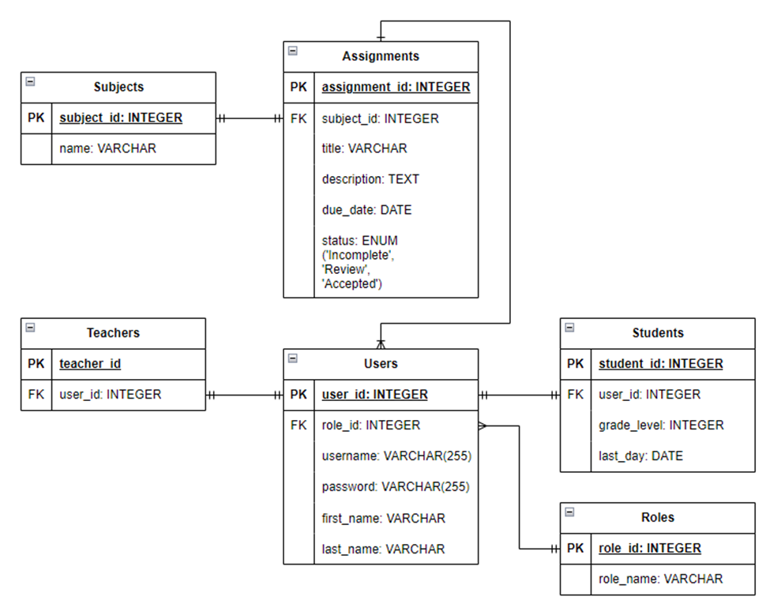
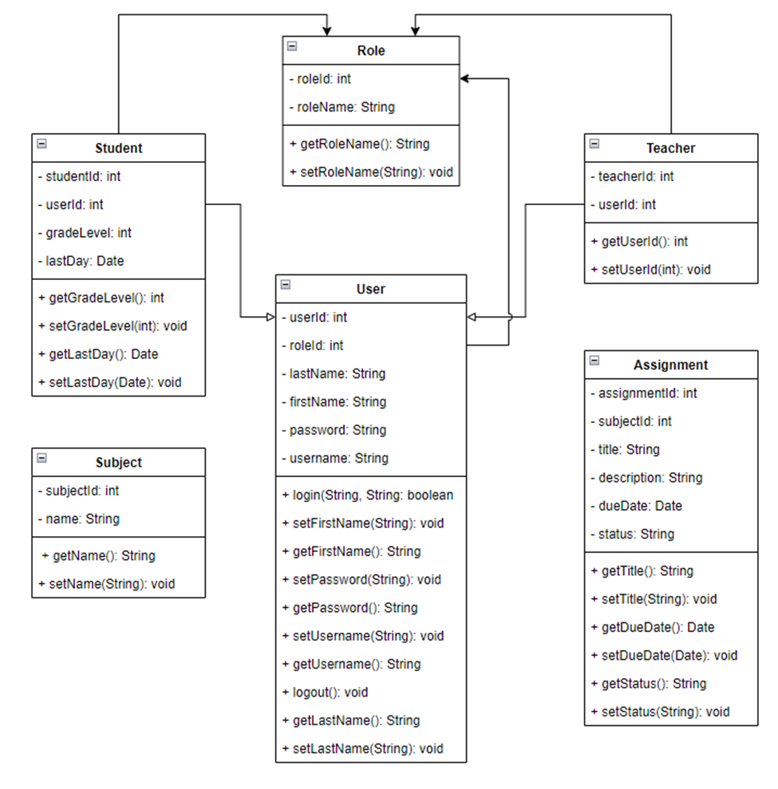
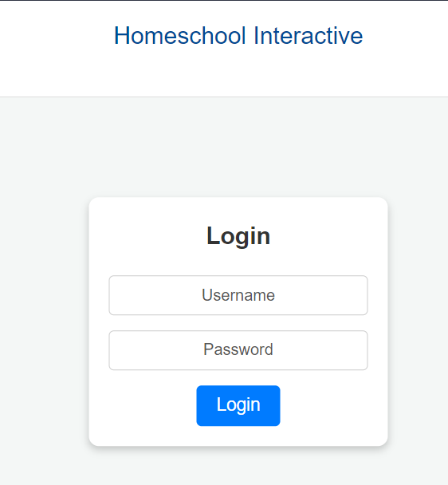
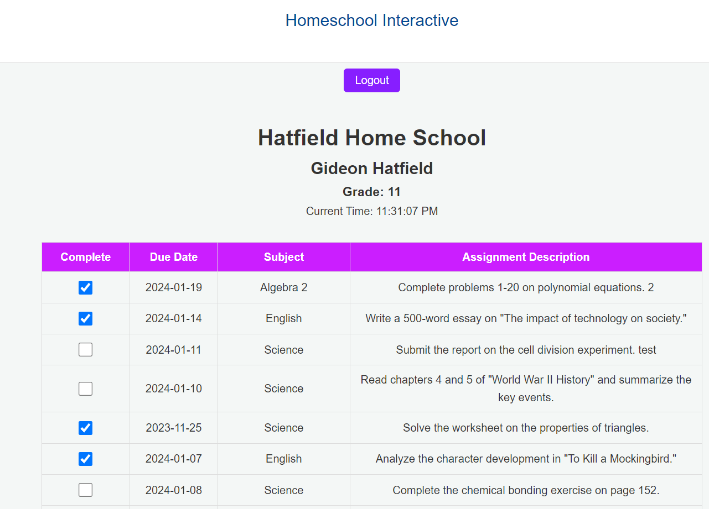
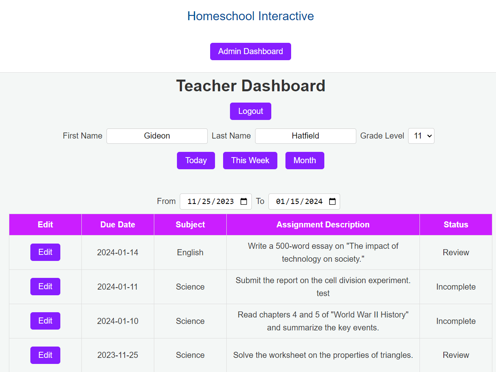
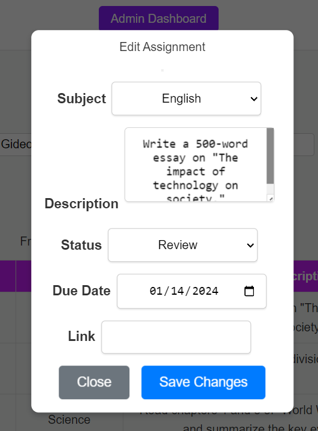
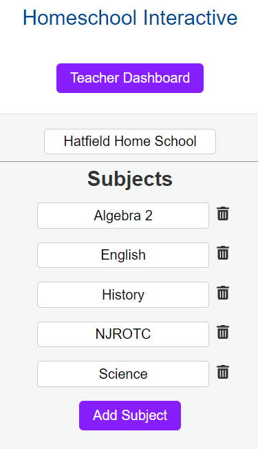

# Homeschool Interactive System - Project Portfolio

---

## Project Overview
The Homeschool Interactive System is a comprehensive web-based platform designed to facilitate effective homeschooling experiences. This system addresses the need for a streamlined, interactive, and accessible educational environment for home-schooled students and their teachers. Its primary objectives are to manage assignments, track grades, and provide a centralized platform for educational activities.

## Design Diagrams
- **System Architecture Diagram**: Illustrates the overall architecture of the Homeschool Interactive system, showcasing the frontend, backend, and database components.


- **Entity-Relationship (ER) Diagram**: Details the database schema, illustrating the relationships between different data entities.


- **UML Class Diagram**


## Code Snippets
- **React Hook for Redirect After Login (Client-Side)**:
This React hook is used to redirect users to appropriate pages based on their roles after logging in.
```javascript
const useRedirectAfterLogin = () => {
const { authState } = useContext(AuthContext);
const navigate = useNavigate();
const location = useLocation();

    useEffect(() => {
        const redirectPath = authState.role === 'ROLE_TEACHER' ? '/teacher' : '/student';

        if (authState.isLoggedIn && location.pathname !== redirectPath) {
            navigate(redirectPath, { replace: true });
        }
    }, [authState, navigate, location.pathname]);
};
```

### Assignment Submission Status Update (Client-Side)
This snippet from the StudentDashboard component shows how the status of an assignment is toggled.

```javascript
const handleToggleAssignmentStatus = async (assignmentId, currentStatus) => {
    const newStatus = currentStatus === "Review" ? "Incomplete" : "Review";
    try {
        await apiClient.put(`/assignments/${assignmentId}/status?status=${newStatus}`);
        setAssignments(prevAssignments =>
            prevAssignments.map(assignment =>
                assignment.assignmentId === assignmentId ? { ...assignment, status: newStatus } : assignment
            )
        );
    } catch (error) {
        console.error("Error updating assignment status:", error);
    }
};
```

### JWT Token Generation (Server-Side)
This Java method from JwtUtil is crucial for creating JWT tokens used in user authentication.

```java
public static String generateToken(String username) {
  return JWT.create()
          .withSubject(username)
          .withExpiresAt(new Date(System.currentTimeMillis() + EXPIRATION_TIME))
          .sign(Algorithm.HMAC512(SECRET_KEY));
}
```

### User Registration (Server-Side)
This method in UserService demonstrates how new users are registered, with password encryption.
```java
public void registerNewUser(User user) {
  user.setPassword(passwordEncoder.encode(user.getPassword()));
  userRepository.save(user);
}
```

### 5. Assignment Creation (Server-Side)
This code snippet from AssignmentController showcases the backend process for creating a new assignment.

```java
@PostMapping
public ResponseEntity<Assignment> createAssignment(@Valid @RequestBody Assignment assignment) {
    Assignment savedAssignment = assignmentService.saveAssignment(assignment);
    return ResponseEntity.status(HttpStatus.CREATED).body(savedAssignment);
}
```

## Screenshots
*Please insert screenshots here.*
1. **Login Screen**: Displays the teacher and student login screen

2. **Student Dashboard**: Showcases the interface where students can view and submit assignments.

3. **Teacher Dashboard**: Displays the functionality available to teachers for displaying assignments.

4. **Edit Assignment Modal**: Displays the functionality available to teachers for editing assignments.

5. **Admin Dashboard**: Displays the functionality available to teachers for grading assignments.


## Technologies Used
- **Frontend**: React.js, HTML, CSS, JavaScript
- **Backend**: Java (Spring Boot)
- **Database**: MySQL
- **Others**: Node.js, JWT for authentication

## Development Process
- **Methodology**: Utilized Agile development, with sprints planned for iterative releases.
- **Phases**:
    1. Requirement Gathering
    2. Design and Prototyping
    3. Development
    4. Testing
    5. Deployment

## Challenges and Solutions
- **Challenge**: Integrating the frontend with backend services securely.
- **Solution**: Implemented JWT-based authentication and thorough API testing.

## Testing and Quality Assurance
- **Unit Testing**: Conducted on both frontend and backend components using frameworks like Jest (for React) and JUnit (for Spring Boot).
- **Integration Testing**: Ensured seamless integration between different parts of the application.

## Future Enhancements
- Integration of a real-time message system for student-teacher interactions.
- Implementation of adding new assignments
- Fixing date change issues.

